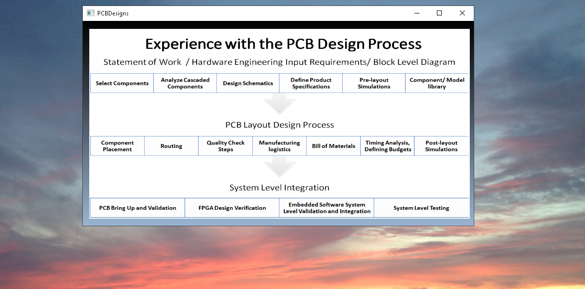
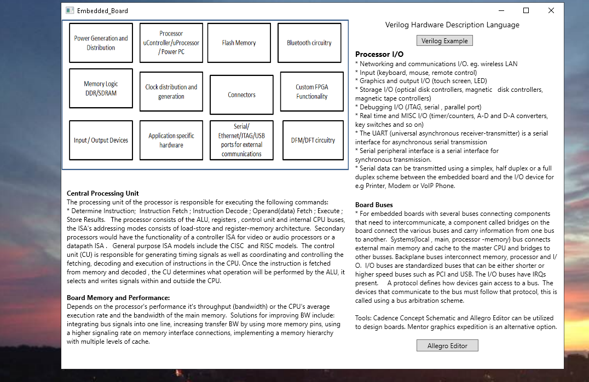
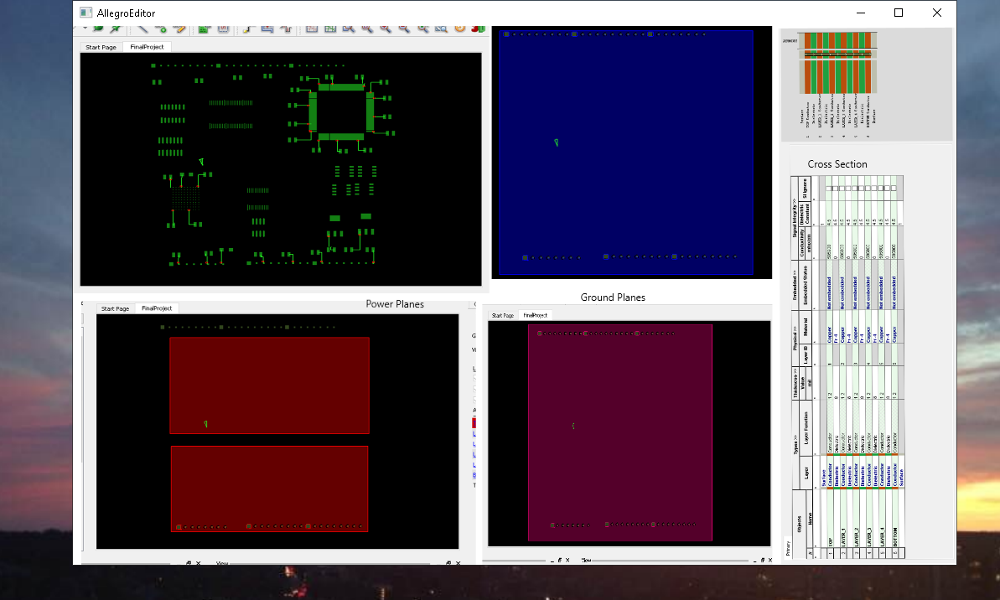
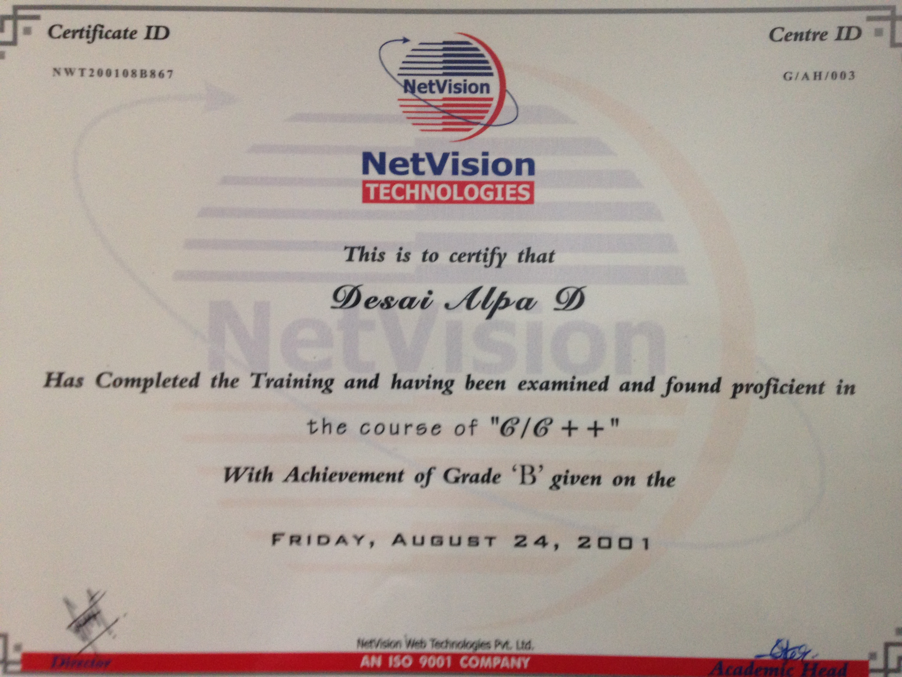
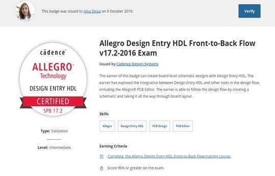
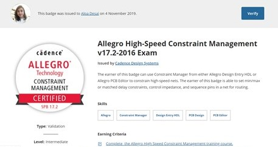
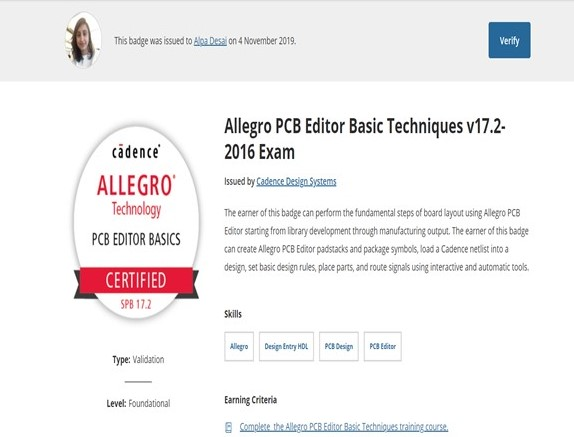

# PCB Design Process

The project provides an introduction to the PCB Design PRocess

Confidential information is not displayed. 

Please download the executable in https://github.com/alpaddesai/PCBDesignProcess/releases for details. 

Images are custom. 

## Top 10 all four years & outstanding testscores

