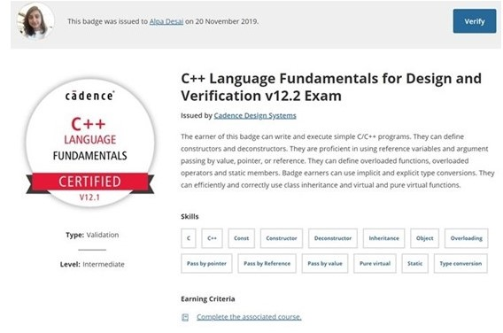

# PCB Design Process

The project provides an introduction to the PCB Design PRocess

Confidential information is not displayed. 

Please download the executable in https://github.com/alpaddesai/PCBDesignProcess/releases for details. 

Images are custom. 

### Allegro Editor

#L.D College of Engineering Coursework includes Linear Electronics; Integrated Electronics;Business organization and Planning; Engineering EEM; Digital electronics; Microprocessor interfacing and progamming; Industrial instrumentation; Power electronic devices; Control theory; Electrical machines;
Network Analysis; Electrical Eng and Electronics; Power systems analysis; Computer programming; Advanced microprocessor;  Project; Mathematics-I; Mathematics-II; Mathematics- III;  
### Allegro Schematic

### Allegro High Speed Designer

### Allegro Editor

